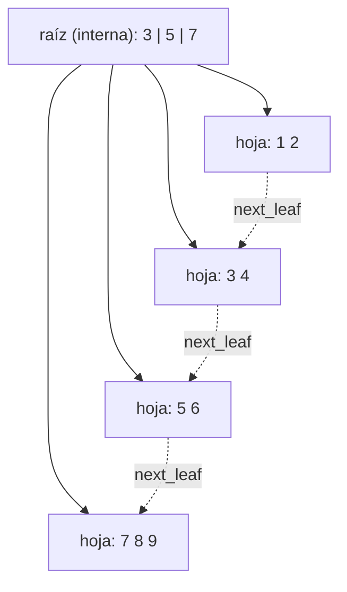
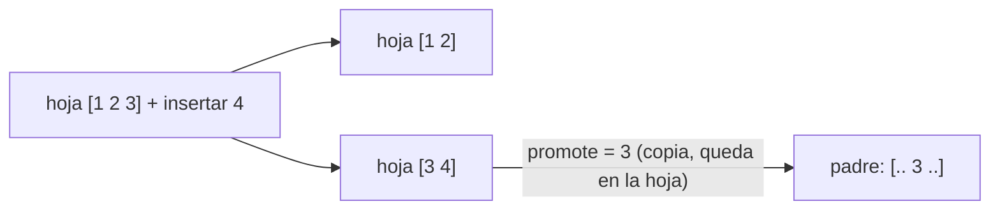
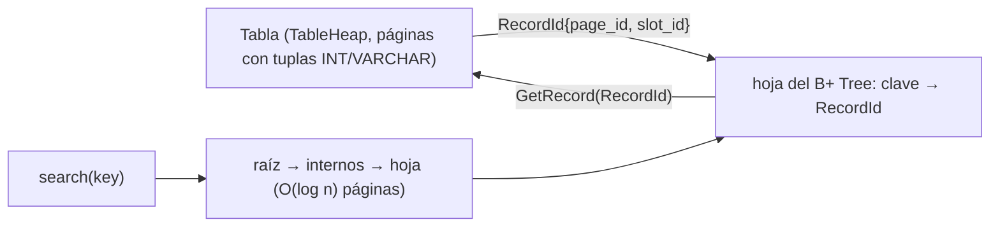

# Fase 1 — Motor de almacenamiento e índice B+ Tree

Este complemento está diseñado para el trabajo **Motor de Base de Datos SQL — Fase 1: Índices B-Tree/B+**. No reemplaza el `HashIndex` existente: añade un segundo índice persistente para cumplir explícitamente las consignas de B/B+ Tree.

## Correspondencia con la consigna

| Consigna | Implementación |
|---|---|
| Storage Engine | Ya existente: `DiskManager`, `BufferPoolManager`, `TablePage`, `TableHeap` |
| Tuplas INT/VARCHAR | Ya existente: `Record`, `Schema`, serialización |
| RowID / PageID | `RecordId { page_id, slot_id }` |
| BTreeNode / nodos | Cada nodo B+ es una página de 4096 bytes gestionada por `BufferPoolManager` |
| `search(key)` | `BPlusTree::Search(int32_t)` |
| `insert(key, RowID)` | `BPlusTree::Insert(int32_t, RecordId)` |
| Split | Hojas e internos; propagación recursiva y nueva raíz |
| Bulk load | `BPlusTree::BulkLoad(...)`: construcción bottom-up (árbol vacío) o inserción verificada (árbol con datos) |
| Control de capacidad | `2t-1` claves máx. por nodo; `Create` valida que quepa en 4096 bytes; `Validate()` comprueba mínimos |
| Index Scan vs Full Scan | ejecutable `btree_demo` |
| Pruebas | `tests/bplus_tree_test.cpp` (22 casos) |

## Diseño

El árbol tiene una **página de cabecera persistente** que almacena `root_page_id`, grado mínimo `t`, número de entradas y número de splits. Esto permite cerrar y volver a abrir el índice conociendo únicamente su `header_page_id`, igual que el índice hash existente.

### Hoja

```text
+----------------------------------------------------------+
| type | key_count | parent | next_leaf | ...              |
+----------------------------------------------------------+
| key:int32 | page_id:uint32 | slot_id:uint16              |
| key:int32 | page_id:uint32 | slot_id:uint16              |
| ...                                                      |
+----------------------------------------------------------+
```

Las hojas guardan `clave -> RecordId`. El enlace `next_leaf` deja preparada la estructura para recorridos por rango.

### Nodo interno

```text
+----------------------------------------------------------+
| type | key_count | parent                               |
+----------------------------------------------------------+
| child0 | key0 | child1 | key1 | child2 | ...            |
+----------------------------------------------------------+
```

Las claves internas separan rangos; los datos reales permanecen en las hojas, por lo que se trata de un **B+ Tree**.

## Grado seleccionado

Se usa el **grado mínimo `t`** (convención de Cormen): todo nodo no raíz tiene entre `t-1` y `2t-1` claves, y un nodo interno entre `t` y `2t` hijos. Un nodo se divide cuando llega a `2t` claves.

- **Por defecto `t = 16`** (hasta 31 claves por nodo, 32 hijos). Con 5.000 filas da altura 3 y los splits se ven claramente en la demo.
- **Pruebas:** `t = 2, 3, 4, 8` provocan splits muy frecuentes y árboles altos con pocos datos.
- **Límite físico:** la hoja ocupa `16 + 10·(2t-1)` bytes, así que `t ≤ 200` cabe en una página de 4096 bytes. `Create` lanza error si se excede. Con `t = 200` el nodo aprovecha la página completa y la altura baja a 2–3 incluso con millones de claves; `t = 16` se eligió por claridad didáctica, no por eficiencia de espacio.
- Se puede cambiar en la demo con `--degree=N`.

## Diagramas

Estructura de un B+ Tree con `t = 2` (máx. 3 claves por nodo) tras insertar 1, 2, …, 9 en orden:



Al insertar 10 la hoja `[7 8 9 10]` se divide en `[7 8]` y `[9 10]`, y la raíz (`3 | 5 | 7 | 9`, 4 claves) se desborda: se divide, sube la clave central y crece la altura a 3.

Split de una hoja (`t = 2`, se inserta 4 en una hoja llena `[1 2 3]`):



En un split **interno** la clave central *sube* y no queda duplicada en ningún hijo.

Relación con el Storage Engine:



## Algoritmos

### Búsqueda

Desde la raíz se elige el hijo cuyo intervalo contiene la clave hasta alcanzar una hoja. Dentro de la hoja se aplica búsqueda ordenada. La altura del árbol es logarítmica, por lo que la navegación requiere `O(log n)` nodos.

### Inserción y split

1. localizar la hoja;
2. insertar ordenadamente `key -> RecordId`;
3. si no hay overflow, persistir la hoja;
4. si hay overflow, dividir en dos hojas;
5. promover la primera clave de la hoja derecha al padre;
6. si el padre se desborda, dividirlo y promover su clave central;
7. si se divide la raíz, crear una nueva raíz y aumentar la altura.

Con `SetTrace(&std::cout)` cada split y cada nueva raíz (con la nueva altura) se imprime en tiempo real para la exposición.

### Bulk load

1. Valida `RecordId` y ordena las entradas por clave; rechaza duplicados **antes** de tocar el árbol.
2. Si el árbol está **vacío** lo construye de abajo hacia arriba: reparte las claves de forma pareja en `ceil(n / (2t-1))` hojas (todas con ≥ `t` claves), enlaza `next_leaf` y agrupa nodos por nivel hasta llegar a una sola raíz. No hay splits y se recorre cada página una vez.
3. Si ya tiene datos, comprueba duplicados contra el árbol y luego usa `Insert`.

Las hojas quedan casi llenas, por lo que las inserciones posteriores en ese rango provocan splits pronto (compromiso habitual del bulk load).

### Verificación de invariantes

`BPlusTree::Validate()` comprueba: claves estrictamente ordenadas, cada clave dentro del rango que fijan los separadores del padre, todas las hojas a la misma profundidad (**balance**), ocupación mínima `t-1` en nodos no raíz, máximo `2t-1`, punteros al padre coherentes, cadena `next_leaf` ordenada y `entry_count` igual al número de claves en hojas. Las pruebas y la demo la llaman después de cada carga.

## Compilación

Después de aplicar el complemento:

```bash
cmake -S . -B build -G Ninja -DCMAKE_BUILD_TYPE=Debug
cmake --build build -j"$(nproc)"
ctest --test-dir build --output-on-failure
```

## Demo

```bash
./build/btree_demo data/btree_fase1.db 5000 200 --trace   # log de splits + comparativa
./build/btree_demo data/btree_fase1.db 5000 200 --sweep   # tabla con 1.000 / 5.000 / 20.000 filas
./build/btree_demo data/btree_fase1.db 5000 200 --degree=4
```

Qué hace, en orden:

1. Crea la tabla `demo(id INT PRIMARY KEY, nombre VARCHAR(30))` con N filas mediante SQL.
2. **Inserción en tiempo real:** inserta las claves en orden aleatorio una a una; con `--trace` imprime cada split y cada crecimiento de altura.
3. **Bulk load** de las mismas claves en un segundo árbol y compara nodos, altura, splits y tiempo.
4. Comprueba `Validate()` en ambos árboles.
5. **Index Scan vs Full Table Scan** con las mismas 200 claves aleatorias: tiempo, nodos visitados / registros examinados y `disk_reads` del Buffer Pool.

Ejemplo de salida real (5.000 filas, `t=16`, build Debug; en Release el Full Scan es más rápido y el speedup baja a ≈80x, pero nodos visitados y registros examinados no cambian):

```text
Insert uno a uno (aleat.)  t=16  entradas=5000  altura=3  nodos=238 (hojas=228)  splits=235  tiempo_us=99058  invariantes=OK
Bulk load (bottom-up)      t=16  entradas=5000  altura=3  nodos=169 (hojas=162)  splits=0    tiempo_us=2612   invariantes=OK

B+ Tree        3147   600 nodos       474
Full Scan    628929   486935 regs    1130
Speedup en tiempo: 199.9x     Por consulta: 3.0 nodos vs 2434.7 registros
```

> Nota metodológica: los tiempos dependen de la máquina y de la caché; la evidencia estable es **nodos visitados por consulta (= altura) frente a registros examinados (~n/2)**. Con tablas muy pequeñas (≈1.000 filas) el Full Scan cabe en el Buffer Pool y casi no hace lecturas de disco, por lo que el índice no gana en I/O; la ventaja de I/O aparece cuando la tabla excede el Buffer Pool (5.000 filas: 474 vs 1.130 lecturas; 20.000 filas: 576 vs 8.934).

## Pruebas (`tests/bplus_tree_test.cpp`, 22 casos)

```bash
ctest --test-dir build -R BPlusTree --output-on-failure
```

- **Básicas:** inserción/búsqueda en una hoja, claves inexistentes, duplicados rechazados.
- **Splits y balance:** split exacto al superar `2t-1`, splits de hojas e internos, altura que crece de uno en uno y se mantiene logarítmica, búsqueda visita exactamente `altura` nodos.
- **Inserción masiva:** 500 claves con `t=2`; 20.000 claves aleatorias con Buffer Pool de 16 frames (obliga a evicciones); orden ascendente, descendente y aleatorio para `t = 2, 3, 4, 8`, con `Validate()` en cada caso.
- **Casos límite:** árbol vacío, `t` inválido (0, 1, >200), página que no es cabecera, `RecordId` inválido, claves negativas y `INT_MIN`/`INT_MAX`, trazas.
- **Bulk load:** distintos tamaños (1, `2t-1`, `2t`, `2t+1`, 100, 997) y grados con entrada desordenada; más compacto que insertar uno a uno; rechazo de duplicados/RIDs inválidos sin carga parcial; carga sobre árbol no vacío y entrada vacía; inserciones posteriores al bulk load.
- **Persistencia:** cerrar y reabrir el árbol desde su `header_page_id`.

## Archivos añadidos

```text
include/minidb/index/bplus_tree.hpp
src/index/bplus_tree.cpp
src/btree_demo.cpp
tests/bplus_tree_test.cpp
docs/FASE1_BTREE.md
```

También se añaden al `CMakeLists.txt` y se exponen accesores controlados a `Database::Heap()` para que la demo pueda comparar ambos caminos usando los `RecordId` reales del Storage Engine.
